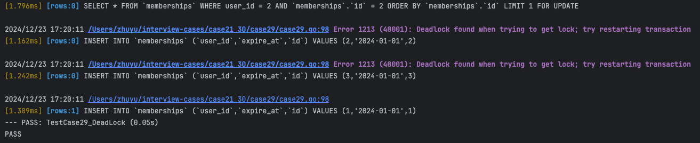

### Mysql死锁案例

#### 模拟死锁的发生

运行case29_test.go下的TestCase29_DeadLock测试用例。会出现死锁现象。 该测试用例起了三个goroutine，每个goroutine都是先查这个用户是不是会员，如果不是就新建一条，如果有就更新他的过期时间。


#### 排查思路
1. 确认问题代码
- 数据库的错误日志，或者业务的错误日志类似如下

- 如果是mysql可以通过 如下命令查看最后一次产生死锁的信息。可以确认引起死锁的sql，进而定位到问题代码
```shell
------------------------
LATEST DETECTED DEADLOCK
------------------------
2024-12-23 09:20:11 281472725504128
*** (1) TRANSACTION:
TRANSACTION 1812, ACTIVE 0 sec inserting
mysql tables in use 1, locked 1
LOCK WAIT 3 lock struct(s), heap size 1128, 2 row lock(s)
MySQL thread id 9, OS thread handle 281473038909568, query id 31 192.168.65.1 root update
INSERT INTO `memberships` (`user_id`,`expire_at`,`id`) VALUES (1,'2024-01-01',1)

*** (1) HOLDS THE LOCK(S):
RECORD LOCKS space id 8 page no 4 n bits 72 index PRIMARY of table `interview_cases`.`memberships` trx id 1812 lock_mode X
Record lock, heap no 1 PHYSICAL RECORD: n_fields 1; compact format; info bits 0
 0: len 8; hex 73757072656d756d; asc supremum;;


*** (1) WAITING FOR THIS LOCK TO BE GRANTED:
RECORD LOCKS space id 8 page no 4 n bits 72 index PRIMARY of table `interview_cases`.`memberships` trx id 1812 lock_mode X insert intention waiting
Record lock, heap no 1 PHYSICAL RECORD: n_fields 1; compact format; info bits 0
 0: len 8; hex 73757072656d756d; asc supremum;;


*** (2) TRANSACTION:
TRANSACTION 1811, ACTIVE 0 sec inserting
mysql tables in use 1, locked 1
LOCK WAIT 3 lock struct(s), heap size 1128, 2 row lock(s)
MySQL thread id 8, OS thread handle 281473166233728, query id 32 192.168.65.1 root update
INSERT INTO `memberships` (`user_id`,`expire_at`,`id`) VALUES (3,'2024-01-01',3)

*** (2) HOLDS THE LOCK(S):
RECORD LOCKS space id 8 page no 4 n bits 72 index PRIMARY of table `interview_cases`.`memberships` trx id 1811 lock_mode X
Record lock, heap no 1 PHYSICAL RECORD: n_fields 1; compact format; info bits 0
 0: len 8; hex 73757072656d756d; asc supremum;;


*** (2) WAITING FOR THIS LOCK TO BE GRANTED:
RECORD LOCKS space id 8 page no 4 n bits 72 index PRIMARY of table `interview_cases`.`memberships` trx id 1811 lock_mode X insert intention waiting
Record lock, heap no 1 PHYSICAL RECORD: n_fields 1; compact format; info bits 0
 0: len 8; hex 73757072656d756d; asc supremum;;


```

#### 调整代码
运行case29_test.go下的TestCase29_RepairDeadLock测试用例。该用例该用的方法改成了，先插入如果唯一键冲突就更新，如果没有冲突就插入成功


