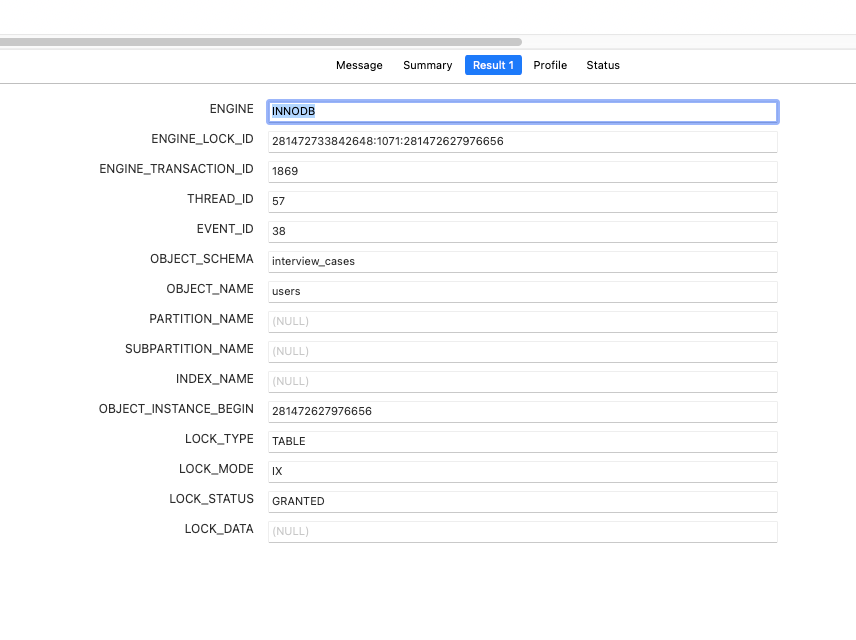

## 表锁案例

## 场景描述
我们的场景是 100 积分兑换一瓶可乐。那么扣积分的时候，要执行的操作就是先查询用户的积分，看看够不够 100 分，而如果积分足够的话，则扣积分。

## 复现间隙锁
运行case30_test.go下的TestCase30函数。这个测试会有个间隙锁。类似如下sql
```shell
-- 记得先开启事务
-- 在这里拿到了  而后执行一大堆的业务操作
BEGIN;
SELECT * FROM users WHERE id = 20000 FOR UPDATE; 
-- 假设说扣积分前是 120 积分，那么扣除之后就是 20 了 
UPDATE users SET credit = 20 WHERE id = 20000;
COMMIT;
```

执行如下sql查看锁的情况

```sql
SELECT * FROM performance_schema.data_locks;
这里有两个锁，但实际生效的下面这个第一个表锁是意向锁，是为了不让表结构改变的锁。真正起作用的是下面的记录锁
```


## 修复方案

那么要优化这个场景，可以使用乐观锁。最简单的乐观锁就是额外使用一个 version 字段，并且在使用乐观锁的时候，并不需要开启事务。
```shell
SELECT * FROM users WHERE id = 1000;
-- 假设查询出来的 version = 123 
UPDATE users set credit = 20, version=124 WHERE id = 1000 AND version = 123;
```
修改后的代码可以参考case30_test.go下的TestCas这个函数